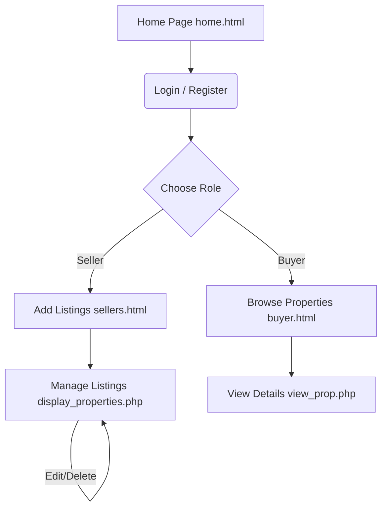

# 🏡 NewGen Real Estate Portal

A modern, responsive, and feature-rich web application for managing real estate listings, connecting buyers and sellers, and handling property portals.

[](https://www.php.net/)
[](https://www.mysql.com/)
[](https://developer.mozilla.org/)
[](https://opensource.org/licenses/MIT)

---

## Table of Contents
1. [Key Features](#-key-features)
2. [Technology Stack](#%EF%B8%8F-technology-stack)
3. [Repository Directory Structure](#%EF%B8%8F-repository-directory-structure)
4. [User Flow & Architecture](#-user-flow--architecture)
5. [Database Setup](#-database-setup)
6. [Installation & Local Development](#-installation--local-development)
7. [Running the Application](#-running-the-application)

---

## Key Features

* ** Dual-Database Authentication:** Separate login structures for users (sign) and properties (sellers/listings).
* ** Role-Based Portals:**
  * **Sellers:** Submit properties with contact details, pricing, descriptions, multi-image upload functionality, and direct Google Maps coordinate URLs. Edit, update, or delete listed properties seamlessly.
  * **Buyers:** Search and browse listings, apply category filters (Apartment, Plot, House, Penthouse), and view detailed contact pages for sellers.
  * **Admin Panel:** Administrative login control panel to monitor the state of portal listings.
* ** Theme Toggle:** Native dark/light mode toggle with smooth transitions.
* ** Multi-Image Gallery:** Supports uploading and managing multiple property images per listing.

---

## Technology Stack

| Layer | Technologies Used | Details |
| :--- | :--- | :--- |
| **Frontend** | HTML5, CSS3, JavaScript (ES6) | Responsive grid layout, custom transitions, dark mode toggle. |
| **Styling** | Vanilla CSS, Bootstrap 5 | Modern styles with interactive flex containers. |
| **Backend** | PHP (OOP Architecture) | Handles secure session states, redirects, and image files. |
| **Database** | MySQL | Multi-relational tables for security and properties. |
| **Server** | Apache (XAMPP / MAMP) | Local environment orchestration. |

---

## 📁 Repository Directory Structure

```text
NewGen_RealEstate/
├── uploads/                  # Directory for uploaded property images
├── admin-login.html          # Administrator login interface
├── admin-login.php           # Backend script for admin authentication
├── buyer.html                # Buyer dashboard containing search & category filters
├── clickhere.html            # Redirect portal helper
├── clickherestyle.css        # Helper stylesheet
├── dashboard.php             # General user portal redirect hub
├── delete_property.php       # Backend handler to delete property listings
├── display_properties.php    # Dashboard showing properties submitted by a seller
├── edit_property.php         # Page to edit properties (fills form details)
├── update_property.php       # Backend script to process property updates
├── fetch_buyer_properties.php# API endpoint fetching buyer-filtered listings (JSON)
├── fetch_user_id.php         # API endpoint returning logged-in user context
├── get_property.php          # API endpoint to retrieve a single listing's details
├── get_seller_properties.php # API endpoint retrieving seller-specific listings
├── home.html                 # App home page with featured properties & dark mode
├── homescript.js             # Main JavaScript file handling theme toggles & animations
├── homestyle.css             # Main styling sheet for landing page
├── login.html                # Seller/Buyer login user interface
├── login.php                 # PHP script handling user sign-in authentication
├── loginstyle.css            # Styles for authentication screens
├── register.php              # PHP script processing user sign-ups
├── save_properties.php       # Handles confirmation & finalizing listings
├── sellers.html              # Form to submit a new property listing
├── signin.html               # Registration user interface
├── signinstyle.css           # Styles for signin/signup page
├── submit_property.php       # Backend handling multi-image upload & inserts
├── view_property.php         # Admin view detail panel
├── view_prop.php             # Public view details layout for buyers
├── README.md                 # Project documentation
└── .gitignore                # Git ignore configuration
```

---

## User Flow & Architecture



---

## Database Setup

This project uses two MySQL databases: `sign` and `property`.

### Step-by-Step Configuration:

1. Launch **Apache** and **MySQL** in your **XAMPP Control Panel**.
2. Open your web browser and navigate to **phpMyAdmin**: `http://localhost/phpmyadmin/`.
3. Go to the **SQL** tab and execute the queries below:

#### 1️⃣ User Database (`sign`)
```sql
CREATE DATABASE IF NOT EXISTS sign;
USE sign;

CREATE TABLE IF NOT EXISTS users (
    id INT AUTO_INCREMENT PRIMARY KEY,
    fullname VARCHAR(255) NOT NULL,
    email VARCHAR(255) NOT NULL UNIQUE,
    password VARCHAR(255) NOT NULL
);
```

#### 2️⃣ Property Database (`property`)
```sql
CREATE DATABASE IF NOT EXISTS property;
USE property;

CREATE TABLE IF NOT EXISTS sellers (
    id INT AUTO_INCREMENT PRIMARY KEY,
    owner_name VARCHAR(255) NOT NULL,
    contact VARCHAR(15) NOT NULL,
    title VARCHAR(255) NOT NULL,
    type VARCHAR(100) NOT NULL,
    purpose VARCHAR(50) NOT NULL,
    price VARCHAR(100) NOT NULL,
    city VARCHAR(100) NOT NULL,
    state VARCHAR(100) NOT NULL,
    description TEXT,
    google_maps_url VARCHAR(500),
    images TEXT,
    name VARCHAR(255) NOT NULL,
    email VARCHAR(255) NOT NULL,
    created_at TIMESTAMP DEFAULT CURRENT_TIMESTAMP
);
```

---

## Installation & Local Development

1. **Clone the Repository**:
   ```bash
   git clone https://github.com/sambhav-132711/NewGen_RealEstate-main
   ```

2. **Move files** to your local server directory:
   * **Windows (XAMPP):** Move the files to `C:\xampp\htdocs\NewGen_RealEstate\`
   * **macOS (XAMPP):** Move the files to `/Applications/XAMPP/xamppfiles/htdocs/NewGen_RealEstate/`

3. **Set Folder Permissions**:
   Make sure the `uploads/` directory has write permissions so users can upload images:
   ```bash
   chmod 777 NewGen_RealEstate/uploads
   ```

---

## Running the Application

1. Open your browser and type:
   ```text
   http://localhost/NewGen_RealEstate/home.html
   ```
2. Interact with the home page, select Dark Mode if desired, and sign in to list properties or browse listings!
